# Project Journey — Karachi Burger & Grill

This is how the Karachi Burger & Grill website was built, phase by phase. It covers what was
built, which tools were chosen and why, and which problems came up and how they were solved.

- **Scope so far:** the customer-facing frontend (`frontend/`). The FastAPI backend comes later.
  The frontend already talks to a single data module (`src/lib/api.ts`), so the backend can
  replace the mock data without touching components.
- **Method:** Spec-Driven Development with SpecKit:
  constitution → spec → clarifications → plan → tasks → implementation in 8 reviewed phases.
  Every phase was checked in the browser by the owner before it was committed.
- **Dates:** 26–27 September 2026. Branch `001-restaurant-frontend`.

---

## 1. Ground rules (the constitution)

Before any code, we wrote down eleven principles in `.specify/memory/constitution.md`. Four of them
shaped almost every decision later on:

| Principle | What it meant in practice |
|---|---|
| **Honesty** | No invented numbers: no "50K+ customers", no fake "4.9 rating", no review counts. Testimonials are labelled **"Sample reviews"**. Star ratings on cards stay hidden until real ratings exist. |
| **Own brand only** | No other brands' names or logos: no cola brand names, and the social icons are our own inline SVGs because lucide dropped brand icons. JazzCash, Easypaisa and Google appear only as plain text. |
| **Motion with restraint** | Every animation switches off under the OS "Reduce motion" setting, and no content is ever hidden behind an animation. |
| **Backend-ready** | Components read data only through `@/lib/api`. An ESLint rule enforces this. |

---

## 2. Tech stack and why

| Tool | Why we chose it |
|---|---|
| **Next.js 16 (App Router, Turbopack)** | Server components render the menu as HTML, which is fast and good for SEO. There are file-based routes for 16 pages plus 33 prerendered item pages, and built-in image, font, sitemap, robots and Open Graph support. |
| **React 19 + TypeScript (strict)** | Typed data model (menu items, options, cart lines, orders), so errors show up at build time. |
| **Tailwind CSS 4 (`@theme` tokens)** | One set of brand tokens (charcoal, ember, flame, cream) used everywhere. The contrast fixes were made once, in the tokens. |
| **Zustand 5 + persist** | Tiny stores for the cart, favourites and UI state, saved to `localStorage`. Hydration is deferred (`skipHydration`) so the server HTML never mismatches. |
| **React Hook Form 7 + Zod 4** | Checkout, contact, login and signup forms with shared schemas. The same schemas can later validate on the FastAPI side via OpenAPI. |
| **motion 13** | Used only for the fly-to-cart animation. Everything else is CSS, to keep the JavaScript small. |
| **lucide-react** | A consistent line-icon set (no brand icons, which suits the brand rule). |
| **Vitest 5** | 67 unit tests: pricing, Wings Wednesday, Pakistan time, scheduling, validation, cart store and catalogue integrity. |
| **Playwright + axe-core** | End-to-end ordering flow, keyboard-only flow, reduced motion, an axe WCAG 2.1 AA scan of 16 pages (including the 404), and overflow / tap-size checks at 360, 768, 1280 and 1920 px. |

---

## 3. What was built, phase by phase

### Phase 1 — Site shell
- Next.js app in `frontend/`: TypeScript strict, Tailwind tokens, three `next/font` families
  (Big Shoulders for headlines, Manrope for body text, Caveat Brush for accents) and 38 brand photos.
- Flame logo, announcement bar, sticky navbar, native-`<dialog>` mobile menu and search, and a
  footer with our own social icons.
- An ESLint rule blocks components from importing mock data directly.

### Phase 2 — Data layer and home hero
- Typed mock catalogue: 33 items, 8 categories, per-item size prices, add-ons, promos, delivery
  areas and sample testimonials.
- Premium hero modelled on `assets/design-reference.png`: the Grand Combo in a fire glow, ember
  particles, floating badges, features strip, category chips, and "Most Loved" tabs.
- Product cards **open the item view; they never add to the cart directly**.

### Phase 3 — Promos, specials, story
- Pakistan-time helpers (fixed UTC+5) and a live "Wings Wednesday" countdown.
- Promo banners, a Chef's Specials bento grid, the Burns Road about teaser, "Sample reviews", and
  the "Taste the fire" call to action.
- **Honesty fixes requested by the owner:** the 4.9 rating and 50K+ figures were replaced with
  "Made fresh, every order" and "Loved across Karachi"; card star ratings were hidden; at most three
  "Bestseller" tags (a test enforces this).

### Phase 4 — Menu and item view
- `/menu` with search, category chips with live counts, and sort. All state lives in the URL, so
  views are shareable.
- **Item view** driven by `?item=slug`: a centred two-column dialog on desktop and a bottom sheet on
  phones. The browser Back button closes it. A required option gates the Add button. Also add-ons,
  a 500-character note, and a quantity stepper on a `Rs X | Add to cart` button.
- `/menu/[slug]` is prerendered for all 33 items (unknown slugs give a 404), with breadcrumbs and
  related items.

### Phase 5 — Cart and pricing rules
- Prices are **always recomputed from the menu**. Nothing trusts a saved price.
- Wings Wednesday discount (Pakistan time). Delivery is Rs 150, and free from Rs 1,500 after
  discounts.
- Slide-in cart drawer and a `/cart` page: steppers, free-delivery progress bar, discount line,
  "deal ended" and "we're closed" notices.
- Fly-to-cart animation plus a bounce on the bag icon.

### Phase 6 — Checkout and confirmation
- Checkout collects name, Pakistani mobile (tidied to `03XX-XXXXXXX`), area, address, landmark and
  notes, with ASAP or a half-hour slot inside opening hours.
- Payment is Cash on Delivery. Card, JazzCash and Easypaisa are shown as "coming soon".
- Inline errors, an error banner, and focus moves to the first invalid field.
- `placeOrder` re-prices every line. The confirmation page shows a `KBG-12345` order number with a
  copy button, the ETA, and a demo tracker that advances every 6 seconds.

### Phase 7 — Remaining pages
- `/favourites`, `/login` and `/signup` (UI only: accounts are "coming soon"), `/about`,
  `/contact` (validated form, no embedded map), `/combos`, `/faq`, `/privacy`, `/terms`, `/track`
  and a branded 404 ("This grill's gone cold").
- The Meal upgrade now shows **"Includes Masala Fries + Chilled Cola"** everywhere: item view,
  cart, checkout and the combos page.

### Phase 8 — Final polish
- **Menu header:** a tilted three-photo collage (smash burger, grill platter, wings) with an ember
  glow fills the right side on desktop.
- **Motion:**
  - soft page-enter transition (`template.tsx`)
  - scroll-driven section reveals (CSS `animation-timeline: view()`, transform only, so content
    is never invisible)
  - hover lift and zoom on cards
  - fly-to-cart on every page
  - all of it off under reduced motion
- **Native-app feel on phones:**
  - drag the item sheet down to close it
  - safe-area padding on bottom bars (`viewport-fit: cover`)
  - no grey tap flash
  - 44 px minimum tap targets, checked automatically
- **Accessibility:**
  - `ember-700` darkened to `#b43c0c` to pass AA on cream
  - ratings exposed as images with labels
  - the scrollable review strip is keyboard-focusable
  - footer and password toggles enlarged
  - axe finds **0 violations** on 16 pages at 4 viewports
- **SEO:**
  - a unique title and description per page
  - a generated 1200×630 Open Graph image (Grand Combo, flame and tagline)
  - flame `icon.svg` plus a generated `apple-icon`
  - `sitemap.xml` covering all pages and 33 items
  - `robots.txt` that keeps cart, checkout, orders and accounts out of search
  - Restaurant JSON-LD on the home page
- **Performance:** see [§5](#5-lighthouse-scores).
- **Docs:** this file and the root `README.md`.

---

## 4. Problems we hit and how we solved them

| Problem | Solution |
|---|---|
| Ember text on cream was 4.4:1, just under AA | Darkened the `ember-700` token to `#b43c0c`, which fixed every use at once. |
| lucide v1 removed brand icons | Wrote small inline SVG social icons (which also fits the "own brand only" rule). |
| Saved cart/favourites caused hydration mismatches | Zustand `persist` with `skipHydration` plus a `StoreHydrator`. UI waits for `useHydrated()`. |
| Wings Wednesday must follow Karachi time, not the visitor's | Fixed UTC+5 arithmetic (Pakistan has no daylight saving) with unit tests at day boundaries. |
| Next 16 breaking changes | `params` is now async, `preload` replaced `priority` on images, `images.qualities` is required, and `useSearchParams` needs a Suspense boundary. We read the bundled docs in `node_modules/next/dist/docs/` rather than guessing. |
| "Reveal" animations hid server-rendered content until JavaScript ran | Moved reveals to pure CSS that animates transform only, never opacity, so text is always readable. |
| Closing a dialog then navigating left the page scroll-locked | `useModalDialog().close()` releases the scroll lock synchronously. |
| Focusing a field inside the bottom sheet scrolled the sheet itself | `overflow-clip` instead of `overflow-hidden` on the `<dialog>`. |
| Headings hidden under the sticky navbar after navigation | `scroll-margin-top` on `#main > *`. |
| Lighthouse flagged a decorative fire photo as the hero's LCP | Replaced it with a CSS radial-gradient ember bed, which looks the same with no image request. |
| Footer newsletter pulled a 400 KB data + Zod chunk into every page | Rewrote it as a tiny form that loads the API module only on submit. |
| The whole catalogue was embedded in every page for the item modal | Item view, cart drawer and fly-to-cart are code-split. They load their data on demand (`useCatalog`) and mount the first time they're opened. |
| 80 KB of inline star SVGs in the home HTML | One CSS-mask star repeated. Home HTML went from 364 to 320 KB. |
| Product cards were hydrated as client components | Cards are server components with tiny client islands (open button, favourite heart, live deal price). |
| Heavy style/layout work for the long menu on phones | `content-visibility: auto` on off-screen sections, which cut mobile Total Blocking Time roughly in half. |
| Checkout e2e test failed in the morning (the restaurant is closed, so ASAP isn't allowed) | The test pins the browser clock to an open hour. |

---

## 5. Lighthouse scores

Measured on the production build (`npm run build && npm run start`) with Lighthouse on this
development laptop, using the median of 5 runs.

| Page | Mobile Performance | Desktop Performance | Accessibility | Best practices | SEO |
|---|---|---|---|---|---|
| `/` (home) | 71 | 93 | 100 | 100 | 100 |
| `/menu` | 72 | 90 | 100 | 100 | 100 |

- **Cumulative Layout Shift is 0** on mobile, and at most 0.006 on desktop /menu (the "good" threshold is 0.1).
- Mobile First Contentful Paint is about 1.2–1.9 s. Largest Contentful Paint is about 4.0–4.2 s.
- **The mobile target of 90 was not reached on this machine.**
  - Lighthouse's mobile mode simulates a slow phone CPU on top of this laptop, and the laptop's
    own benchmark varied between runs (index about 1,300–1,900). The same build scored anywhere
    from 62 to 87 on home.
  - The remaining cost is React hydrating a long, image-rich page.
  - Measure again with PageSpeed Insights after deploying to Vercel, which gives a stable reference.

---

## 6. Before launch

- [ ] Real phone number, email and social links in `frontend/src/lib/data/site.ts`. These are
      placeholders today.
- [ ] Set `NEXT_PUBLIC_SITE_URL` to the real domain (used by Open Graph, sitemap and robots).
- [ ] Connect the FastAPI backend behind `src/lib/api.ts` (see
      `specs/001-restaurant-frontend/contracts/`).
- [ ] Real ratings and reviews before showing stars on cards or removing the "Sample reviews" label.
- [ ] Online payments, accounts and Google sign-in (all shown as "coming soon" today).

---

## 7. Screenshots

Generated by `SCREENSHOTS=1 npx playwright test tests/e2e/responsive.spec.ts --project=mobile-360 --project=desktop-1280`
into `docs/screenshots/`.

| Page | Phone (360 px) | Desktop (1280 px) |
|---|---|---|
| Home | 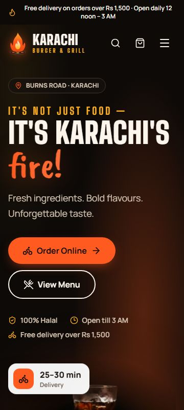 | 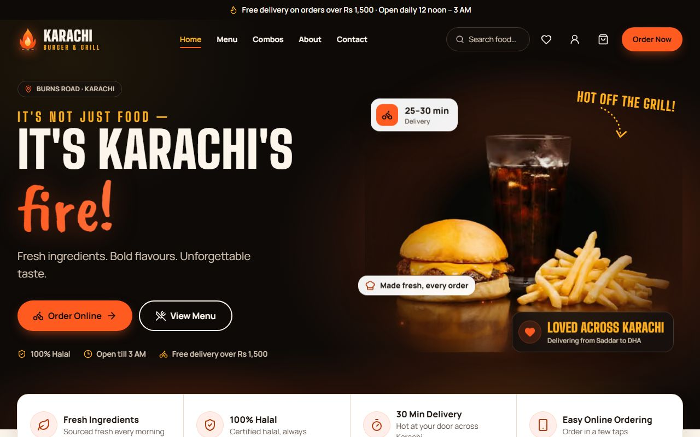 |
| Menu | 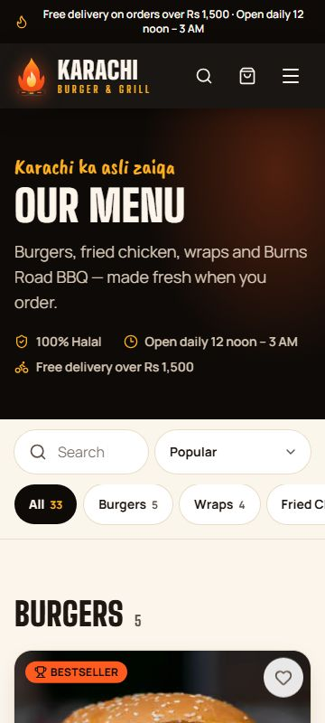 | 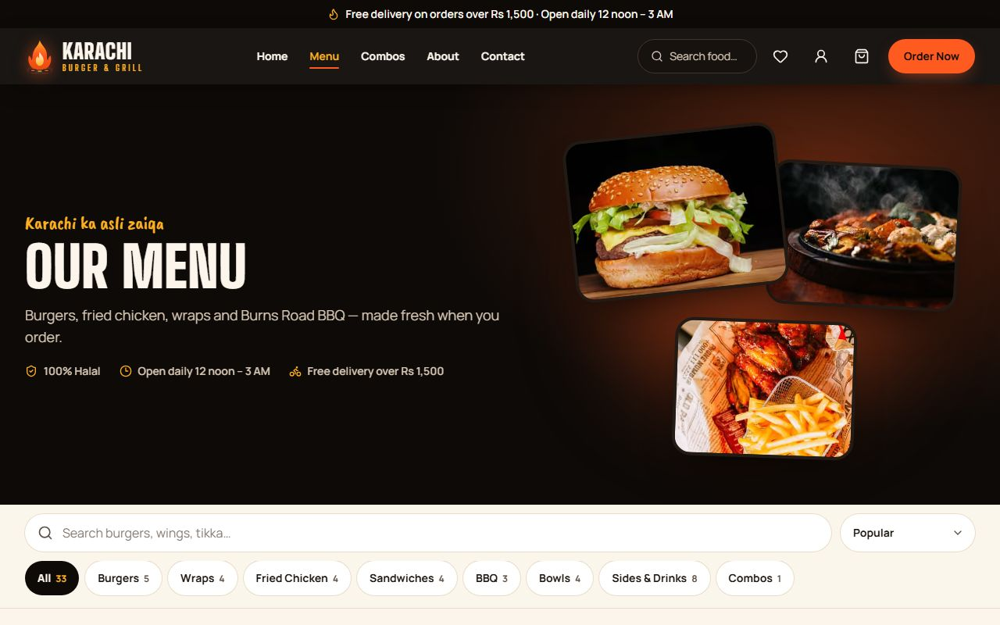 |
| Checkout | 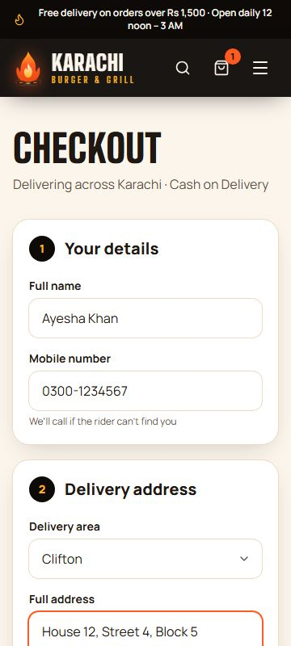 | 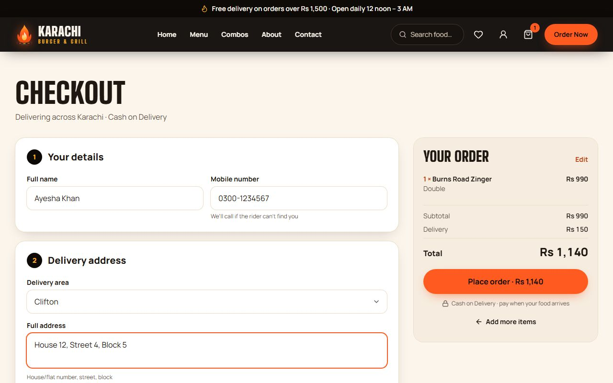 |
| Item view | 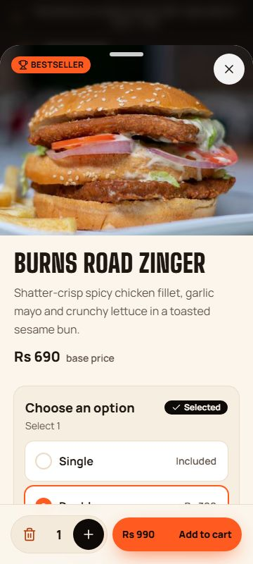 | 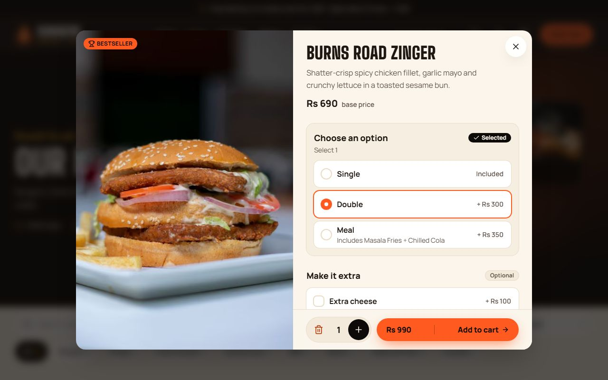 |
| Cart | 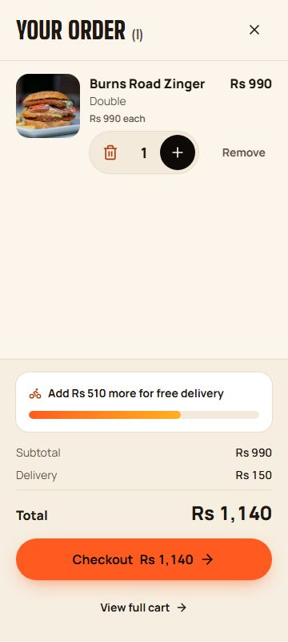 | 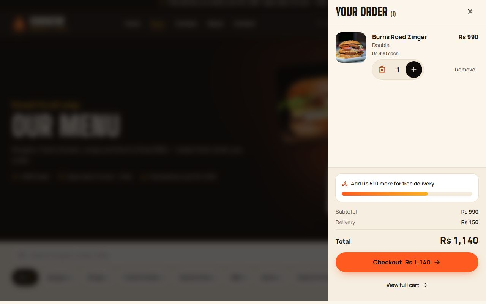 |
| Order tracker | 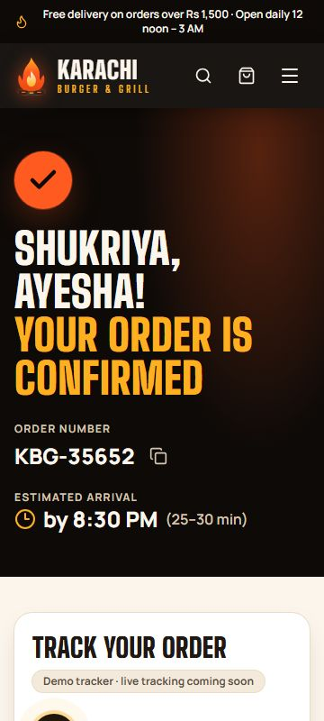 | 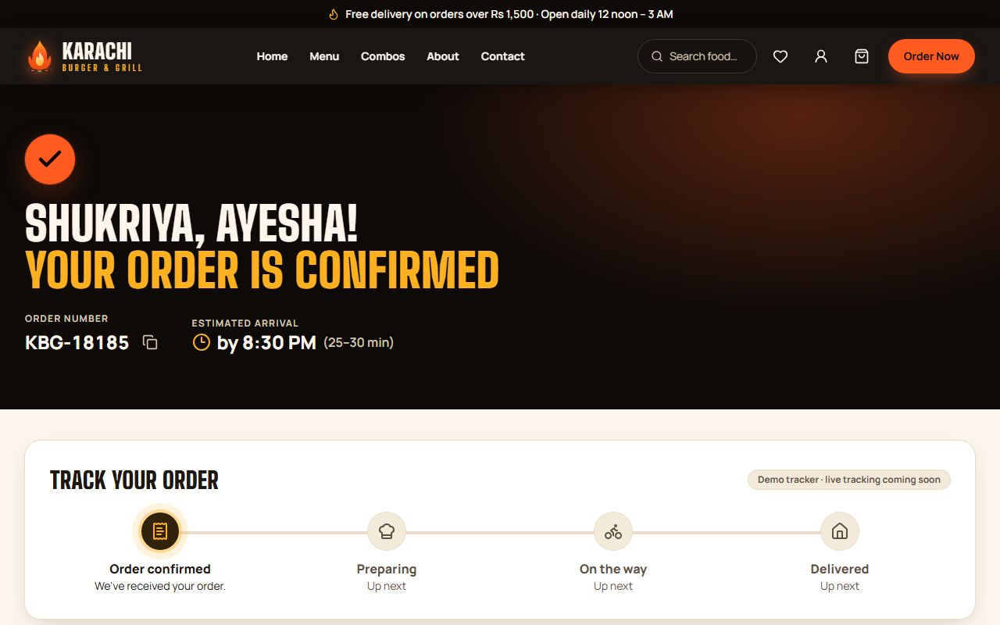 |
| About | 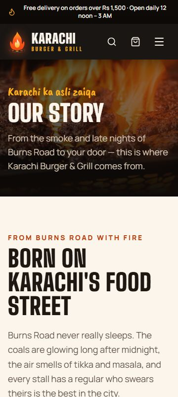 | 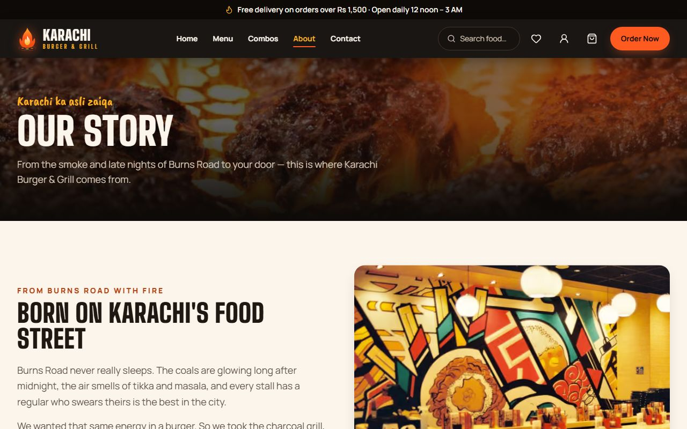 |

Placeholder to add by hand:

- _[Screenshot: branded 404 page]_
